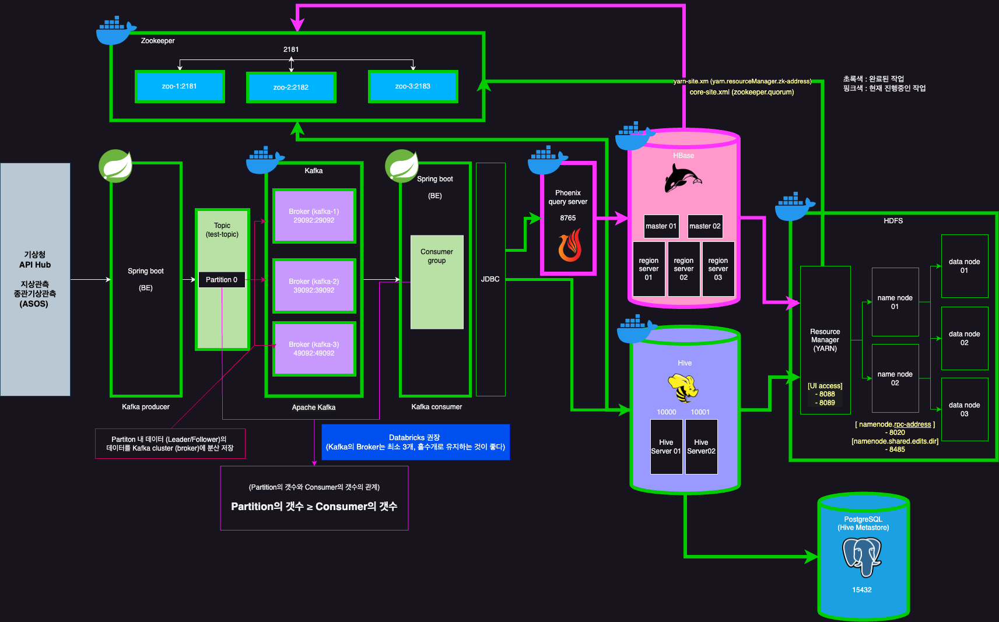

<link rel="stylesheet" href="./styles.css" />

```
/*****************************************************************************/
*
* Copyright         : 2024/04/18 이현기(Lee Hyungi)
* File Name         : README.md
* Description       : 해당 파일은 Hadoop EcoSystem 설치 및 구성에 있어 실행에 
                      필요한 전반적인 내용을 포함하고 있습니다.
*                    
* Revision History  :
* Date		      Author 			Comments
  2024/04/17  이현기 (Lee Hyungi)     초안 작성
* -----------------------------------------------------------------------------
* 2024/04/18        	            (초안 작성) Hadoop EcoSystem 구성 및 설정내용 작성
                                              설치 순서 상세내용 작성
* -----------------------------------------------------------------------------
* 2024/04/19        	            (초안 작성) Hive, Postgres 구성 및 설정내용 작성
                                              종합 설치 방법에 대해 상세내용 작성
* -----------------------------------------------------------------------------
* 
/****************************************************************************/
```

# 데이터 플랫폼 구성

## <u>시스템 구성도</u>



## <u>Hadoop EcoSystem Docker container 구성</u>

### <u>Hadoop EcoSystem version 구성</u>

`yellow : 작성완료` `pink : 진행중`
<table>
    <tr>
        <th style="text-align: center">index</th>
        <th style="text-align: center">component</th>
        <th style="text-align: center">image</th>
        <th style="text-align: center">version</th>
        <th style="text-align: center">release date</th>
    </tr>
    <tr style="text-align: center">
        <td class="complete">1</td>
        <td class="complete">Zookeeper</td>
        <td class="complete">Docker official image</td>
        <td class="complete">3.9.2</td>
        <td class="complete">2024/04/16</td>
    </tr>
    <tr style="text-align: center">
        <td class="complete">2</td>
        <td class="complete">Kafka</td>
        <td class="complete">Official Confluent Docker Image <br/>(Community)</td>
        <td class="complete">7.4.4</td>
        <td class="complete">2024/04/11</td>
    </tr>
    <tr style="text-align: center">
        <td class="complete">3</td>
        <td class="complete">Hadoop</td>
        <td class="complete">자체 제작 이미지 사용</td>
        <td class="complete">3.3.6</td>
        <td class="complete">2023/06/23</td>
    </tr>
    <tr style="text-align: center">
        <td class="complete">4</td>
        <td class="complete">Hive</td>
        <td class="complete">자체 제작 이미지 사용</td>
        <td class="complete">4.0.0</td>
        <td class="complete">2024/03/29</td>
    </tr>
    <tr style="text-align: center">
        <td class="complete">5</td>
        <td class="complete">Tez</td>
        <td class="complete">Hive 이미지 생성시 내부에 Engine 설치 및 환경설정</td>
        <td class="complete">0.10.3</td>
        <td class="complete">2024/01/31</td>
    </tr>
    <tr style="text-align: center">
        <td class="progress">6</td>
        <td class="progress">HBase</td>
        <td class="progress">자체 제작 이미지 사용</td>
        <td class="progress">2.5.8</td>
        <td class="progress">2024/03/12</td>
    </tr>
    <tr style="text-align: center">
        <td class="progress">7</td>
        <td class="progress">Phoenix</td>
        <td class="progress">자체 제작 이미지 사용</td>
        <td class="progress">5.2.0</td>
        <td class="progress">2024/04/16</td>
    </tr>
    <tr style="text-align: center">
        <td class="complete">8</td>
        <td class="complete">PostgreSQL</td>
        <td class="complete">Docker official image</td>
        <td class="complete">15.6</td>
        <td class="complete">2024/02/08</td>
    </tr>
</table>


### <u>Docker container Port 구성 및 설정</u>

<table>
    <tr>
        <th style="text-align: center">index</th>
        <th style="text-align: center">component</th>
        <th style="text-align: center">port</th>
        <th style="text-align: center">dependencies</th>
        <th style="text-align: center">Configuration</th>
    </tr>
    <tr style="text-align: center">
        <td class="complete">1</td>
        <td class="complete">Zookeeper</td>
        <td class="complete">
            <div class="align-center">
                - zoo-1(2181)<br/>
                - zoo-2(2182)<br/>
                - zoo-3(2183)
            </div>
        </td>
        <td class="complete">none</td>
        <td class="complete"></td>
    </tr>
    <tr style="text-align: center">
        <td class="complete">2</td>
        <td class="complete">Kafka</td>
        <td class="complete">
            <div class="align-center">
                - kafka-1(29092)<br/>
                - kafka-2(39092)<br/> 
                - kafka-3(49092)
            </div>
        </td>
        <td class="complete">
            <div class="align-center">
                [Zookeeper] <br/>- zoo-1<br/>- zoo-2<br/>- zoo-3
            </div>
        </td>
    </tr>
    <tr style="text-align: center">
        <td class="complete">3</td>
        <td class="complete">Hadoop</td>
        <td class="complete align-center">
            <div class="align-center">
                [NameNode 01] <br/> - 50070 (NameNode Web UI)<br/>- 8088 (YARN RM Web UI)<br/>
            </div>
            <br/>
            <div class="align-center">
                [NameNode 02] <br/> - 50080 (NameNoe Web UI)<br/>- 8089 (YARN RM Web UI)<br/>
            </div>
        </td>
        <td class="complete">
            <div class="align-center">
                [Zookeeper] <br/>- zoo-1<br/>- zoo-2<br/>- zoo-3
            </div>
        </td>
    </tr>
    <tr style="text-align: center">
        <td class="complete">4</td>
        <td class="complete">Hive</td>
        <td class="complete">
            <div class="align-center">
                [HiveServer 01] <br/> - 10000
            </div>
            <br/>
            <div class="align-center">
                [HiveServer 02] <br/> - 10002
            </div>
        </td>
        <td class="complete">
            <div class="align-center">
                [Zookeeper] <br/> - zoo-1<br/>- zoo-2<br/>- zoo-3
            </div>
            <br/>
            <div class="align-center">
                [Hadoop] <br/> - nn01<br/>- nn02<br/>- dn01<br/>- dn02<br/>- dn03
            </div>
            <br/>
            <div class="align-center">
                [Metastore] <br/> - metastore
            </div>
        </td>
    </tr>
    <tr style="text-align: center">
        <td class="complete">5</td>
        <td class="complete">Tez</td>
        <td class="complete">(Hive Execution Engine)</td>
        <td class="complete">Hive 내부에 구성</td>
    </tr>
    <tr style="text-align: center">
        <td class="progress">6</td>
        <td class="progress">HBase</td>
        <td class="progress">
            <div class="align-center">
                [HMaster 01 / 02] <br/> - 16000 / TBD
            </div>
            <br/>
            <div class="align-center">
                [HRegionServer 01 / 02 / 03] <br/> - 16020 / TBD / TBD
            </div>
        </td>
        <td class="progress">
            <div class="align-center">
                [Zookeeper] <br/>- zoo-1<br/>- zoo-2<br/>- zoo-3
            </div>
            <br/>        
            <div class="align-center">
                [Hadoop] <br/>- nn01<br/>- nn02<br/>- dn01<br/>- dn02<br/>- dn03
            </div>        
        </td>
    </tr>
    <tr style="text-align: center">
        <td class="progress">7</td>
        <td class="progress">Phoenix</td>
        <td class="progress">8765</td>
        <td class="progress">
            <div class="align-center">
                [Zookeeper] <br/>- zoo-1<br/>- zoo-2<br/>- zoo-3
            </div>        
            <div class="align-center">
                [Hadoop] <br/>- nn01<br/>- nn02<br/>- dn01<br/>- dn02<br/>- dn03
            </div>        
            <div class="align-center">
                [HBase] <br/>- master01<br/>- master02<br/>- region_server01<br/>- region_server02<br/>- region_server03
            </div>        
        </td>
    </tr>
    <tr style="text-align: center">
        <td class="complete">8</td>
        <td class="complete">PostgreSQL</td>
        <td class="complete">15432</td>
        <td class="complete">none</td>
    </tr>
</table>

### <u>설치 방법</u>

(1) Hadoop EcoSystem 설치하기

- 아래 명령어를 실행하면, 필요한 도커 이미지 빌드 및 docker-compose.yml 파일이 실행됩니다.

    ```zsh   
    $ python installer.py all start
    ```
